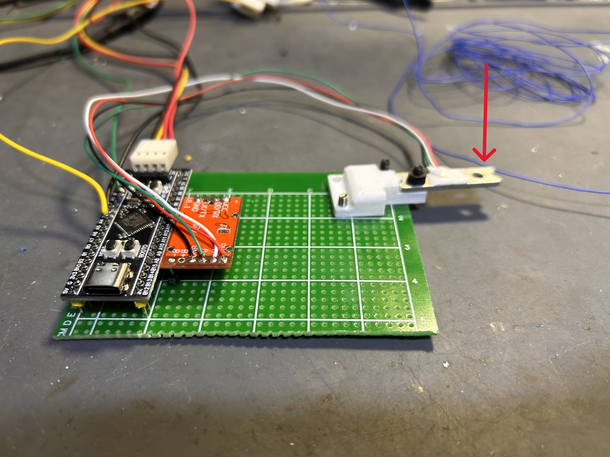
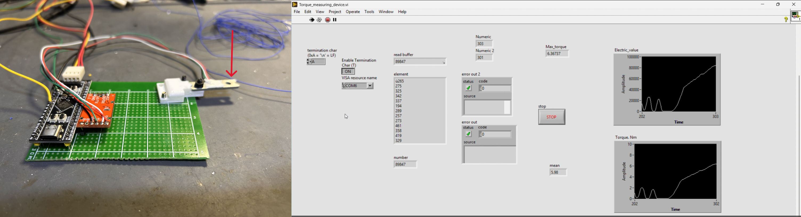

# Motor Torque & Performance Measurement Rig



A small load-cell-based test bench for pulling raw torque data off a BLDC/DC motor, built around an STM32F103, an HX711 load-cell amplifier, and a LabVIEW front end for logging and visualization.

## Overview

The idea is simple: mount the motor so its output shaft presses down on the exposed side of a load cell. As the motor spins up, the shaft pushes on the load cell, and the resulting force reading — combined with the known lever arm — gives the instantaneous torque the motor is producing. Logging that force over the full spin-up (stall to steady state) produces a torque-vs-time curve, from which max torque and mean torque are extracted directly.

Pair that torque data with a **no-load RPM** reading (taken separately with a simple RPM counter/tachometer) and you have the two numbers needed to sketch the motor's torque–speed performance curve, the same kind of chart you'd see on a motor datasheet.

### Jump to a section

- [How it works](#how-it-works)
- [Hardware](#hardware)
- [Firmware details](#firmware-details)
- [Data flow](#data-flow)
- [LabVIEW test](#labview-test)
- [Building the performance curve](#building-the-performance-curve)
- [Repository contents](#repository-contents)
- [Future improvements](#future-improvements)

---

## How it works

1. **Mechanical setup** — The motor is fixed to a rig so its shaft bears directly onto the load cell's exposed sensing surface.
2. **Load cell → HX711 → MCU** — The load cell's differential output feeds into an HX711 24-bit ADC/amplifier breakout (the orange board in the photo above). The HX711 is bit-banged over two GPIO lines (clock `CK` and data `DO`) from an STM32F103 board.
3. **Firmware (STM32F103, `main.c`)** — On boot, the firmware:
   - Initializes the DWT cycle counter for microsecond-accurate delays (`DWT_Delay_Init`, `delay_us`).
   - Runs a 10-sample calibration pass (`Calibrate_HX711`) to determine a zero-load offset, which is subtracted from every subsequent reading.
   - In the main loop, reads the HX711 every 20 ms (`HX711_read`, which bit-bangs the HX711's 24-bit gain-128 protocol and sign-extends the result) and streams each sample out over USART2 at 115200 baud as a newline-terminated ASCII integer (`send_telemetry`).
   - An LED toggles on every telemetry send as a visual heartbeat.
4. **Host-side logging (LabVIEW)** — A LabVIEW VI opens the STM32's serial port over VISA, reads the incoming line-terminated integers, converts them into force/torque, and plots + logs the result live. See [LabVIEW test](#labview-test) below.

## Hardware

- STM32F103-based custom breakout board (USB-C, onboard buttons/BOOT0, prototyping grid)
- HX711 load-cell amplifier breakout
- Load cell with a 3D-printed shaft-contact fixture
- USB-to-serial link (via USART2) to a PC running LabVIEW
- Motor under test, rigidly mounted so its shaft loads the cell

## Firmware details

| Function | Purpose |
|---|---|
| `DWT_Delay_Init` / `delay_us` | Cycle-counter-based microsecond delay used for HX711 clock timing |
| `HX711_read` | Waits for HX711 data-ready, clocks out 24 bits, sign-extends to `int32_t`, subtracts the calibration offset |
| `Calibrate_HX711` | Averages 10 readings at startup to establish a zero-load baseline |
| `send_telemetry` | Reads the load cell and transmits the value over UART as an ASCII string; also tracks worst-case read timing via `HX711_cycles_max` |
| Main loop | Fires `send_telemetry` on a 20 ms cadence (HX711 conversions take ~8 ms per read at the configured gain) |

## Data flow

```
Motor shaft → Load cell → HX711 → STM32F103 (USART2, 115200) → PC (VISA/COM) → LabVIEW
                                                                                  ├─ raw signal plot
                                                                                  ├─ torque plot
                                                                                  ├─ max torque
                                                                                  └─ mean torque
```

## LabVIEW test



*Left: the STM32F103 + HX711 hardware mounted to the load cell. Right: the LabVIEW front panel during a live test run.*

The VI opens the STM32's COM port over VISA, reads the newline-terminated integer stream coming off `send_telemetry`, and:

- Plots the raw load-cell signal (`Electric_value`) as it comes in.
- Derives and plots `Torque, Nm` over time.
- Continuously updates `Max_torque` and a running `mean` torque from the stream.
- Exposes basic serial config (port, termination character) and a `STOP` control to end the run.

## Building the performance curve

1. Run the rig and capture the torque-vs-time trace during spin-up (LabVIEW logs `Max_torque` and mean torque automatically).
2. Separately measure the motor's **no-load RPM** with an RPM counter/tachometer.
3. Plotting the max (stall-ish) torque against the no-load RPM point gives the two anchor points of the classic linear torque–speed performance curve for the motor.

## Repository contents

- `main.c` — STM32F103 firmware (HX711 read + UART telemetry)
- `images/IMG_3034.jpeg` — Load cell + STM32F103 hardware setup
- `images/labview_data.png` — LabVIEW front panel showing live torque acquisition
- `images/test_setup_combined.png` — Hardware and LabVIEW panel side by side

## Future improvements

- Add a motor driver stage that LabVIEW can command directly, so the PC controls motor start/stop rather than triggering it manually.
- Feed that start/stop timing back into LabVIEW so it can timestamp exactly when the motor was started, when the shaft first contacted the load cell, and when it stopped — removing manual guesswork from the torque-vs-time alignment and improving measurement accuracy and repeatability.
